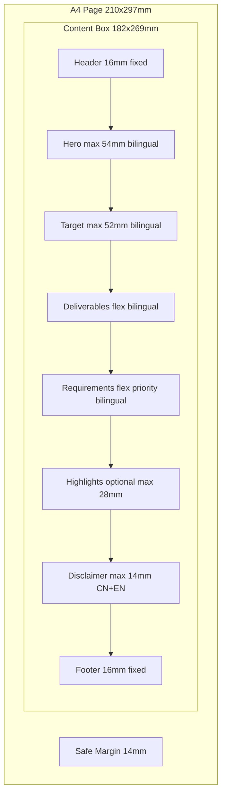
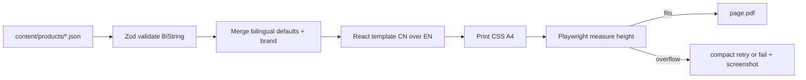
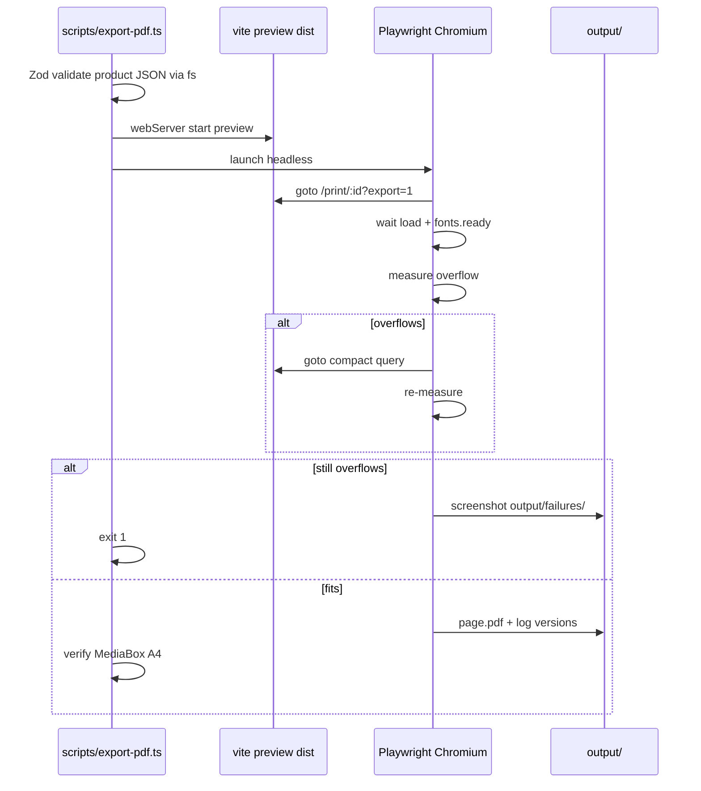
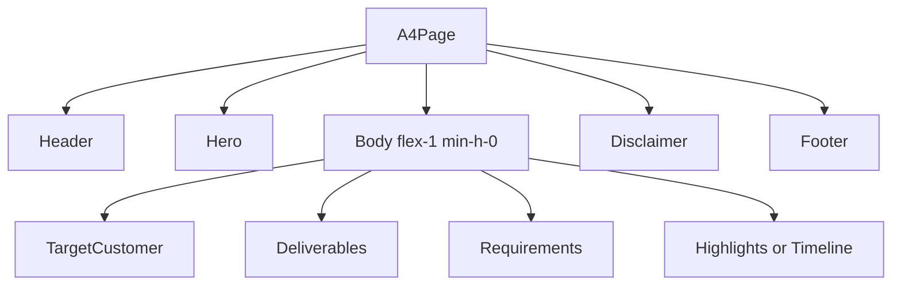
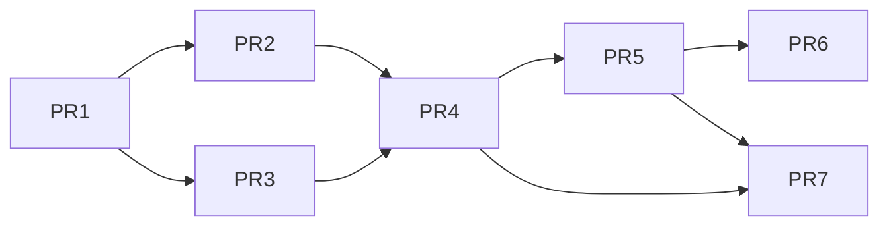

# A4 Premium Print Template System — Design Document

| Field | Value |
|-------|--------|
| **Title** | A4 Apple-Style Print Template System for Education Consulting Materials |
| **Author** | TBD |
| **Date** | 2026-07-16 |
| **Status** | **Approved** (design review freeze + product decisions applied) |
| **Domain** | China mainland education consulting (university application services) |
| **Tech** | TypeScript, React, Vite, Tailwind CSS, Playwright PDF export |
| **Workspace** | `poster_business` (greenfield) |
| **Revision** | R3 — user decisions: **full bilingual CN+EN** chrome+body; confirm single A4 fail-on-overflow; system blue + placeholder logo; default disclaimer always on |

---

## Overview

This document proposes a reusable **A4 page template system** for a China-mainland education consulting company that helps students apply to universities. Deliverables are **strict single-page** print-ready PDFs for sales and counseling: stable layout, premium Apple-inspired aesthetics, and typed **full bilingual (CN+EN)** content for product/service name, target customer, customer requirements, **service deliverables**, chrome labels, disclaimer, and brand/contact blocks.

Because the workspace is greenfield, the design covers visual system, fixed A4 geometry with a **layout contract**, bilingual content schema, TypeScript + Tailwind architecture, PDF export pipeline (including server bootstrap), Chinese typography and **font subsetting**, component model, and an incremental PR plan. Each page is **data-driven**: product JSON fills typed slots; React renders at exact A4 dimensions; Playwright exports PDF and **fails the build if content overflows** the page. Bilingual density does **not** relax the overflow policy — authors must keep EN copy short and use compact density when needed.

---

## Background & Motivation

### Current state

- No existing codebase or template pipeline in `poster_business`.
- Marketing and counseling materials for university-application services are typically produced ad hoc (Canva, Word, designer handoffs), causing:
  - Inconsistent visual quality and brand perception
  - Slow turnaround when product packages change
  - Hard-to-maintain bilingual or Chinese-first print layouts
  - Non-print-safe margins, fonts that substitute at print shop, weak hierarchy

### Pain points to solve

1. **Structure drift** — every designer/PM invents a new layout; customers cannot scan “who is this for / what do they need / what do they get” quickly.
2. **Print risk** — screen-first layouts break at 300 DPI, clip content, cut into safe margins, or lose CJK glyphs.
3. **Content ops** — product names, segments, deliverables, and requirement checklists change often; content should not require redesign.
4. **Premium positioning** — education consulting is trust-heavy; materials must feel calm, precise, and high-end (Apple-like), not flashy poster kitsch.

### Business context

- Primary audience: students and parents in mainland China considering domestic and/or overseas university applications (**v1 default example content: overseas UG/PG application packages**; domestic products use the same schema).
- **Language (product decision, final):** **Full bilingual CN+EN** — every chrome label and every body block carries both Simplified Chinese (primary) and English (secondary). Not CN-only chrome.
- **v1 content slots (required + optional), each bilingual:**
  - **Product / service name** (required)
  - **Target customer** (required)
  - **Service deliverables** — 服务内容 / Service inclusions (required)
  - **Requirements for the customer** — 客户需具备 / Client requirements (required)
  - **Highlights or short timeline** (optional, mutually exclusive under space budget — see schema)
  - **Brand / contact / WeChat QR / disclaimer** (brand-level; **disclaimer always rendered in CN+EN**)
- Output: **strict single A4**, PDF for print and WeChat/digital share (same RGB file).

---

## Goals & Non-Goals

### Goals

1. Define a **stable A4 page structure** with a **fixed layout contract** (zone heights, flex priority) and a **4 mm vertical rhythm**.
2. Establish an **Apple-inspired visual design system** with **frozen tokens** (not ranges) legal and practical for CJK print.
3. Provide a **typed content model** covering sellable one-pager fields (not only “requirements”).
4. Ship a **TypeScript + React + Vite + Tailwind** project that renders print-accurate pages and exports PDF via Playwright.
5. Deliver a **PDF export pipeline** with correct A4 MediaBox, embedded fonts, safe margins, and **hard fail on overflow**.
6. Support **full bilingual CN+EN** presentation (chrome + body) with CN primary / EN secondary typography.
7. Make templates **reusable**: one layout family, many product instances via git JSON.

### Non-Goals (v1)

- Interactive web marketing site or CMS UI (engineers/consultants edit JSON; form UI is post-MVP).
- Full multi-brand theming engine or white-label portal.
- Exact Apple San Francisco licensing for commercial print.
- In-browser CMYK conversion (RGB PDF + print-shop prepress).
- Multi-page booklets, photo-heavy magazine layouts, dynamic charts.
- Multi-page overflow (page 2) — **explicitly v2**; v1 is strict single page.
- Server-side multi-tenant SaaS auth, payment, or customer portal.
- Pixel-perfect match to an offline brand book until assets are provided (tokens have v1 defaults).

---

## Proposed Design

### 1. Visual design system (Apple-style, print-safe)

**Principles**

| Principle | Application |
|-----------|-------------|
| Generous whitespace | Outer safe margin **14 mm**; section gap always **12 mm** (`mm-12`) |
| Clear hierarchy | One dominant product title; section titles secondary; body tertiary |
| Restraint | 1 accent + neutrals; no gradients; no drop shadows in print |
| Precision | 4 mm base rhythm; hairline **0.5 pt** only; frozen type tokens |
| Calm premium | Pure white paper, near-black text, muted captions |

#### Frozen color tokens

| Token | Hex (RGB) | Tailwind | Print note |
|-------|-----------|----------|------------|
| `paper` | `#FFFFFF` | `bg-paper` | Commercial print white |
| `ink` | `#1D1D1F` | `text-ink` | Near-black; prepress may map to rich black |
| `ink-secondary` | `#6E6E73` | `text-ink-secondary` | Captions, EN name, secondary lines |
| `ink-tertiary` | `#86868B` | `text-ink-tertiary` | Footer meta |
| `rule` | `#D2D2D7` | `border-rule` / Hairline | Dividers |
| `accent` | `#0071E3` | `text-accent` / `bg-accent` | **v1 default until brand confirms**; sparingly |
| `soft` | `#F5F5F7` | `bg-soft` | SoftPanel fill only |

#### Typography (print-safe stacks)

Apple SF is **not** licensed for arbitrary commercial embedding.

| Role | Family | Notes |
|------|--------|--------|
| All CJK + UI | `"Noto Sans SC"` (subset, embedded) | Primary for print + preview |
| Latin (optional EN name) | `"Noto Sans SC"` Latin glyphs or `"Inter"` if bundled | Prefer single family to simplify embed |
| Fallbacks (screen only) | `"PingFang SC"`, `"Microsoft YaHei"`, `sans-serif` | Must not be sole print fonts |

#### Frozen type scale (single source of truth)

Weights **must match shipped font faces** (no CSS 600 — Noto SC static has no SemiBold; synthetic bold is forbidden in print).

| Token | Tailwind key | Size | Weight | Line-height | Letter-spacing | Use |
|-------|--------------|------|--------|-------------|----------------|-----|
| Display | `text-print-display` | **28 pt** | **700** | **1.25** | `0` | Product name (max 2 lines) |
| Title | `text-print-title` | **14 pt** | **700** | **1.35** | `0` | Section titles |
| Body | `text-print-body` | **10.5 pt** | **400** | **1.60** | `0` | Paragraphs, list labels |
| Body compact | `text-print-body-sm` | **9.5 pt** | **400** | **1.50** | `0` | Compact mode only |
| Label | `text-print-label` | **8.5 pt** | **500** | **1.40** | Latin only: `0.04em`; CN: `0` | Eyebrow labels (服务方案) |
| Meta | `text-print-meta` | **8 pt** | **400** | **1.40** | `0` | Footer, version |
| EN display | `text-print-en-display` | **12 pt** | **400** | **1.30** | `0` | Product name EN under CN display |
| EN title | `text-print-en-title` | **10 pt** | **400** | **1.30** | `0` | Section title EN under CN title |
| EN body | `text-print-en-body` | **9 pt** | **400** | **1.40** | `0` | Body/list EN secondary under CN |
| EN label | `text-print-en-label` | **7.5 pt** | **400** | **1.30** | `0` | Chrome label EN under CN label |
| EN meta | `text-print-en-meta` | **7.5 pt** | **400** | **1.30** | `0` | Footer/disclaimer EN |

**CSS `font-weight` → file mapping (required)**

| CSS weight | Face file | Notes |
|------------|-----------|--------|
| 400 | `NotoSansSC-Regular.woff2` | Body, meta, EN |
| 500 | `NotoSansSC-Medium.woff2` | Labels / eyebrows only |
| 700 | `NotoSansSC-Bold.woff2` | Display + section titles |
| 600 | **Do not use** | No face shipped; would faux-bold in PDF |

**No ranges in implementation.** Brand review may change token values later via one config file; components only reference tokens. PR 5 visual QA: titles must not look synthetic-bold (true Bold face only).

#### Bilingual visual rules (product decision: full CN+EN)

**Pattern (consistent everywhere):** **CN primary line(s)** then **EN secondary line(s)** immediately below — never side-by-side dual columns for the same field (saves width; clearer hierarchy).

| Element | CN style | EN style |
|---------|----------|----------|
| Product name | `print-display` / ink / 700 | `print-en-display` / **ink-secondary** / 400 |
| Section titles | `print-title` / ink / 700 | `print-en-title` / ink-secondary / 400 |
| Body & list labels | `print-body` (or body-sm compact) / ink / 400 | `print-en-body` / ink-secondary / 400 |
| Chrome labels (eyebrows) | `print-label` / ink-secondary / 500 | `print-en-label` / ink-tertiary / 400 |
| Disclaimer / footer meta | `print-meta` / ink-tertiary | `print-en-meta` / ink-tertiary |
| Gap CN → EN within a pair | **1 mm** (`mm-1`) | — |
| Transform | None on CN; **no all-caps** on CN | None required on EN (sentence case); no forced uppercase |
| Chips / segments | CN text in chip; optional EN on second chip row or `zh / en` if both short — prefer **two chip rows** (CN row then EN row) only if space; else CN chips only + EN in summary | EN summary always required |

**Space risk (explicit):** Full bilingual roughly doubles vertical text. **Overflow policy unchanged** (fail after compact retry). Mitigations: shorter EN (Zod max tighter on `.en`), default `layout.density` may promote compact more often, omit highlights when bilingual lists are long, drop QR if tight. Authors own fit; engineering does not ship clipped PDFs.

#### Frozen spacing scale (4 mm rhythm)

| Token | Value | Tailwind | Use |
|-------|-------|----------|-----|
| `mm-1` | 1 mm | `* -mm-1` | Micro (chip gap half-step rare) |
| `mm-2` | 2 mm | `gap-mm-2`, `p-mm-2` | Chip gap, tight list gap |
| `mm-4` | 4 mm | `gap-mm-4` | **Base unit**; item spacing default |
| `mm-6` | 6 mm | `mt-mm-6` | Label → title within section |
| `mm-8` | 8 mm | `py-mm-8` | SoftPanel internal padding |
| `mm-12` | 12 mm | `gap-mm-12`, `mt-mm-12` | **Section gap (always)** |
| `mm-14` | 14 mm | `p-mm-14` | Safe area padding |

**Naming rule:** only the `mm-*` prefix for print spacing (do **not** use `p-print-1` or parallel systems).

#### Visual spec (Apple-like, specification-level)

| Spec | Value |
|------|--------|
| Corner radius | **0** on page chrome and SoftPanel for document feel; chips **2 mm** radius only |
| Hairline | **0.5 pt** solid `rule`; full content width; **0** vertical inset (edge-to-edge within safe box) |
| Section label → title gap | `mm-2` |
| Section title → body gap | `mm-4` |
| List item gap (normal) | `mm-4` |
| List item gap (compact) | `mm-2` |
| Logo max height | **8 mm** |
| Logo max width | **36 mm** |
| Chip height | **6 mm** min; padding `1.5 mm` × `3 mm`; radius **2 mm**; bg `soft`; text `print-label` / ink |
| Accent usage max | (1) optional **2 pt** left bar on SoftPanel **or** (2) list numbers in `accent` — **not both full-bleed accent fills**; accent surface ≤ ~5% page area |
| Product name align | **Left** (never center body copy) |
| Empty optional fields | Omit zone entirely (no empty SoftPanel, no “N/A”) |
| Forbidden in `/print` | Gradients, `shadow-*`, `ring-*`, blur, animated utilities, stock photo backgrounds |

**Do**

- Left-aligned hierarchy, hairline between major zones, numbered requirements in ink or accent digits only.
- SoftPanel only around deliverables **or** requirements (pick denser block; default: requirements).

**Don’t**

- Center long CJK paragraphs; full-width blue hero banners; uppercase tracking on Chinese labels; drop shadows on cards in print.

#### CJK rules

- Simplified Chinese body; no Latin letter-spacing on CJK runs.
- Body line-height **1.60** (compact **1.50**); never &lt; 1.45 for CJK body.
- Full-width Chinese punctuation; do not rely on hanging punctuation.
- Mixed CN/EN: Latin for codes (G5, A-Level); natural CJK wrap.
- Long URLs only in footer at `print-meta`.

### 2. Fixed A4 layout structure & layout contract

**Page geometry (frozen)**

| Spec | Value |
|------|--------|
| Page size | A4 = **210 mm × 297 mm** |
| CSS | `width: 210mm; height: 297mm` |
| Bleed v1 | **None** |
| Safe margin | **14 mm** all sides |
| Content box | **182 mm × 269 mm** (210−28 × 297−28) |
| Print DPI (raster assets) | 300 DPI target; type stays vector in PDF |

#### Overflow policy (v1 — critical)

| Rule | Detail |
|------|--------|
| Page model | **Strict single A4** only |
| CSS | `.a4-page` uses `height: 297mm` and `overflow: hidden` **only as a visual frame for on-screen preview**. Export must not treat clipping as success |
| Export gate | After fonts ready, measure `[data-page="a4"]` → `scrollHeight` vs `clientHeight` (or measure `.a4-safe` content height vs 269 mm). If content exceeds page by **&gt; 0.5 mm** equivalent, **exit non-zero**, write screenshot to `output/failures/`, **do not** write a “successful” PDF (or write PDF only with `--force` debug flag) |
| Compact mode | If `layout.density === "compact"` **or** export detects overflow once, re-render with compact tokens (**implemented in PR 5**: `text-print-body-sm`, list `gap-mm-2`, tighter chip wrap) and re-measure; if still overflow → **fail**. PR 6 only adds author polish + smoke — not the first working compact path |
| Multi-page | **Out of scope for v1** (v2 may add continued requirements page with repeated header/footer) |
| Authoring prevention | Zod hard limits (see §3) land in **PR 3**, not deferred |

#### Zone layout contract (stack variant — v1 default)

All heights are **maximums** unless marked fixed. Body flexes; footer is pinned.

| Zone | Height contract | Notes |
|------|-----------------|-------|
| Header | **fixed 16 mm** | Logo 8 mm + vertical center; doc label right |
| Hairline | **0.5 pt** + **mm-4** gap after | — |
| Hero | **max 54 mm** | Bilingual hero rules below. **No** `cycleLabel` / `priceBand` in Hero |
| Target customer | **max 52 mm** content | Summary CN ≤ 2 lines + EN ≤ 2 lines; chips CN (EN optional second row) |
| Deliverables | **flex share** | Bilingual list items (CN then EN under each) |
| Requirements | **flex share; priority consumer** | SoftPanel; bilingual numbered list |
| Highlights / timeline | **0 or max 28 mm** | Bilingual; only if space ≥ **28 mm**; else omit if `dropOptionalIfTight` |
| Disclaimer | **max 14 mm** | **Always on**, CN + EN (both required) |
| Footer | **fixed 16 mm** | Contact, version, “1/1”, optional QR; cycle/price; bilingual CTA if present |

**Hero content rules (bilingual, 54 mm cap)**

| Element | Rule |
|---------|------|
| Category `BiString` | CN 1 line + EN 1 line (`print-label` / `print-en-label`) |
| `product.name.zh` | ≤ **2 lines** at 28 pt / 1.25; if tagline present, Zod max length **16** (prefer 1 line) |
| `product.name.en` | **Required** ≤ 1 line; `print-en-display` |
| `product.tagline` | Optional `BiString`; each language ≤ 1 line |
| Stack budget | category pair + name pair + optional tagline pair + gaps ≤ **54 mm** |
| `meta.cycleLabel` / `meta.priceBand` | **Footer only** as `BiString` |

**Fixed-zone budget check (content box 269 mm, stack, no highlights, bilingual)**

| Block | Budget |
|-------|--------|
| Header + post-rule gap | 16 + 4 = 20 mm |
| Hero max | 54 mm |
| Target max | 52 mm |
| Section gaps (×3) | 36 mm |
| Disclaimer + Footer | 14 + 16 = 30 mm |
| **Subtotal reserved** | **192 mm** |
| **Remaining for Deliverables + Requirements** | **≥ 77 mm** (bilingual lists are dense — prefer ≤4 deliverables + ≤5 requirements or `density: compact`; export fails if over) |

**Flex priority when tight (implementation order):**

1. Keep Header, Hero (enforce max lines), Footer, Disclaimer.
2. Keep Requirements (shrink to compact density first).
3. Keep Deliverables (compact list).
4. Shrink Target chips (hide `profiles` before `segments` before truncating summary — summary must remain; if summary alone overflows Zod max, fail validation earlier).
5. Drop Highlights/timeline entirely.
6. Drop QR if present and still overflow (contact line remains).
7. Fail export if still overflow.

**Annotated dimensioned stack (chosen numbers)**

```
A4 210 × 297 mm
┌─────────────────────────────────────────────┐
│ padding 14 mm                               │
│ ┌─ content 182 × 269 mm ──────────────────┐ │
│ │ HEADER           h = 16 mm (fixed)      │ │
│ │  logo≤8mm  companyName     服务说明      │ │
│ │ rule 0.5pt + gap 4mm                    │ │
│ │ HERO             h ≤ 54 mm (bilingual)  │ │
│ │  服务方案 / Service plan (label pair)   │ │
│ │  name.zh 28pt/700 · name.en 12pt/400    │ │
│ │  tagline.zh + tagline.en optional       │ │
│ │  (cycle/price → footer only)            │ │
│ │ gap 12 mm                               │ │
│ │ TARGET           h ≤ 52 mm              │ │
│ │  适合人群 / Who it's for + summary Bi   │ │
│ │ gap 12 mm                               │ │
│ │ DELIVERABLES     flex (priority 3)      │ │
│ │  服务内容 / Inclusions + Bi list items  │ │
│ │ gap 12 mm                               │ │
│ │ REQUIREMENTS     flex (priority 2)      │ │
│ │  SoftPanel + numbered Bi list           │ │
│ │ gap 12 mm (if highlights shown)         │ │
│ │ HIGHLIGHTS       0 or ≤ 28 mm           │ │
│ │ DISCLAIMER       h ≤ 14 mm (CN+EN)      │ │
│ │ FOOTER           h = 16 mm (fixed)      │ │
│ │  cycle · price · contact · 1/1 · [QR]   │ │
│ └─────────────────────────────────────────┘ │
└─────────────────────────────────────────────┘
```

#### Grid

- **v1 stack:** single column; **no 12-column grid ceremony**.
- **v1.1 / PR 7 split (optional):** content width **182 mm**; gutter **4 mm**; 12 columns:

```text
colWidth = (182 − 11×4) / 12 = (182 − 44) / 12 = 11.5 mm
```

  - Target: `col-span-5` → 5×11.5 + 4×4 = **73.5 mm**
  - Requirements: `col-span-7` → 7×11.5 + 6×4 = **104.5 mm**
  - Variant is **data-driven only** (`layout.variant: "split"`); **no viewport breakpoints**.
  - Max ~22 CN chars per line in 5-col at body size (guide for authors); Zod does not enforce per-column measure.

**Mermaid — page zone model**



### 3. Content model / data schema

TypeScript types are source of truth; **Zod** validates at load and in CLI before export.

**Canonical bilingual pattern:** every user-facing string is a **`BiString`** `{ zh: string; en: string }`. Both keys **required** for required fields (empty string not allowed — min length on each). Chrome defaults and product copy use the same shape. Do **not** use parallel top-level `titleZh`/`titleEn` fields — one object keeps merge and components uniform.

```typescript
// src/content/types.ts

export type TemplateId = "a4-service-onepager-v1";

/** Full bilingual unit — CN primary, EN secondary in layout */
export interface BiString {
  zh: string;
  en: string;
}

export interface BrandConfig {
  companyName: BiString;
  logoSrc?: string;              // SVG preferred; PNG min width 600px if used
  accentColor?: string;          // hex; default #0071E3 (product-confirmed)
  contactLine?: string;          // phone / site (language-neutral OK)
  wechatId?: string;
  qrSrc?: string;
  legalLine?: BiString;          // short 备案/entity
  ctaLabel?: BiString;           // e.g. 预约顾问 / Book a consultation
  ctaDetail?: BiString;          // e.g. 扫码添加顾问微信 / Scan to add WeChat
}

export interface TargetCustomer {
  title?: BiString;              // default chrome: 适合人群 / Who it's for
  summary: BiString;             // required both languages
  segments?: BiString[];         // max 6; chips show zh (en optional second row)
  profiles?: BiString[];         // max 3
}

export interface ListItem {
  id: string;
  label: BiString;               // both required
  detail?: BiString;
  mandatory?: boolean;           // requirements; default true
}

export interface ServiceOnePagerContent {
  templateId: TemplateId;
  /**
   * Presentation mode. v1 product decision: full bilingual only.
   * Not a pure BCP-47 tag — means “render CN primary + EN secondary everywhere.”
   */
  locale: "zh-CN-en";
  meta: {
    documentTitle: BiString;     // PDF title may join "zh — en"
    version: string;
    confidential?: boolean;
    updatedAt?: string;
    /** Overrides default bilingual disclaimer if set (both langs required when set) */
    disclaimer?: BiString;
    cycleLabel?: BiString;
    priceBand?: BiString;
  };
  product: {
    name: BiString;              // both required
    categoryLabel?: BiString;
    tagline?: BiString;
  };
  targetCustomer: TargetCustomer;
  deliverables: {
    title?: BiString;
    intro?: BiString;
    items: ListItem[];           // hard 1–6
  };
  requirements: {
    title?: BiString;
    intro?: BiString;
    items: ListItem[];           // hard 1–8 (recommend ≤5 when bilingual)
  };
  highlights?: {
    title?: BiString;
    items: BiString[];           // max 4
  };
  timeline?: {
    title?: BiString;
    steps: { id: string; label: BiString; timeHint?: BiString }[]; // max 4
  };
  brand: BrandConfig;
  layout?: {
    variant?: "stack" | "split";
    density?: "normal" | "compact";  // compact more often needed for bilingual
    showHighlights?: boolean;
    showQr?: boolean;
    dropOptionalIfTight?: boolean;   // default true
    softPanelOn?: "requirements" | "deliverables" | "none";
    /** Always true in v1 — EN secondary always rendered; flag reserved for future */
    bilingual?: true;
  };
}
```

#### Validation rules (hard Zod — PR 3)

| Field | Constraint |
|-------|------------|
| `locale` | Literal **`"zh-CN-en"`** only |
| Every required `BiString` | `zh` and `en` both non-empty after trim |
| `product.name.zh` | min 2 max **24**; if `tagline` set → max **16** |
| `product.name.en` | min 2 max **40** (prefer short) |
| `product.tagline.*.zh` | max **40**; `.en` max **56** |
| `targetCustomer.summary.zh` | min 8 max **72**; `.en` min 8 max **90** |
| `targetCustomer.segments` | max **6**; each `.zh` max 12, `.en` max 18 |
| `deliverables.items` | min **1** max **6**; `label.zh` max 32, `label.en` max 48 |
| `requirements.items` | min **1** max **8**; same label caps; recommend ≤5 bilingual |
| `highlights.items` | max **4**; each side max 28 / 40 |
| `timeline.steps` | max **4** |
| `highlights` + `timeline` | mutually exclusive |
| `logoSrc` | SVG free; PNG min width 600 px guidance |
| `meta.disclaimer` | optional override; if set both langs required; else **defaults** (always rendered) |

#### Space budget / mutual exclusion (authoring guide)

| Block | Required? | Space class |
|-------|-----------|-------------|
| Hero product (Bi) | Yes | Max 54 mm |
| Target (Bi) | Yes | Max 52 mm |
| Deliverables (Bi) | Yes | Flex |
| Requirements (Bi) | Yes | Flex priority |
| Highlights **or** Timeline (Bi) | No | ≤28 mm; omit if tight |
| QR | No | Footer; drop if tight |
| Price / cycle (Bi) | No | Footer only |
| Disclaimer (Bi) | **Yes always** | Max 14 mm — default strings |

**Authoring tip:** EN copy should be **shorter than a full translation** where possible (scan-friendly). Long EN is the main overflow risk.

#### Defaults merge order

```text
chrome BiStrings (src/content/defaults/bilingual.ts)
  ← brand defaults (content/brand/default.json)  // BiString companyName, cta, etc.
    ← product JSON (content/products/<id>.json)
```

Resolve: `title = content.section.title ?? DEFAULTS.sectionTitle` (both `zh`/`en` from defaults when omitted).

#### Example instance

```json
{
  "templateId": "a4-service-onepager-v1",
  "locale": "zh-CN-en",
  "meta": {
    "documentTitle": {
      "zh": "英本冲刺计划-服务说明",
      "en": "UK UG Sprint — Service Overview"
    },
    "version": "2026.07",
    "cycleLabel": { "zh": "2026 秋季入学", "en": "2026 Fall intake" },
    "priceBand": { "zh": "面议", "en": "Quote on request" },
    "confidential": false
  },
  "product": {
    "name": { "zh": "英本冲刺计划", "en": "UK Undergraduate Sprint" },
    "categoryLabel": { "zh": "本科申请服务", "en": "Undergraduate admissions" },
    "tagline": {
      "zh": "面向冲刺 G5 / 罗素集团的系统化申请方案",
      "en": "Structured support for G5 / Russell Group targets"
    }
  },
  "targetCustomer": {
    "summary": {
      "zh": "成绩优异、目标英国本科、需要结构化时间线与文书指导的高中生及家长。",
      "en": "High-achieving students and parents targeting UK UG with structured timelines and essay support."
    },
    "segments": [
      { "zh": "高二–高三", "en": "G11–G12" },
      { "zh": "A-Level / 国际课程", "en": "A-Level / intl. curriculum" },
      { "zh": "冲刺顶尖院校", "en": "Top-tier targets" }
    ]
  },
  "deliverables": {
    "items": [
      {
        "id": "d1",
        "label": {
          "zh": "选校定位与名单策略（含专业匹配）",
          "en": "School list strategy and major fit"
        }
      },
      {
        "id": "d2",
        "label": {
          "zh": "主文书与补充文书多轮修改",
          "en": "Personal statement and supplements (multi-round)"
        }
      },
      {
        "id": "d3",
        "label": {
          "zh": "推荐信指导与递交清单管理",
          "en": "Reference guidance and submission checklist"
        }
      },
      {
        "id": "d4",
        "label": {
          "zh": "关键节点规划与家长同步会",
          "en": "Milestone plan and parent sync meetings"
        }
      }
    ]
  },
  "requirements": {
    "items": [
      {
        "id": "r1",
        "label": {
          "zh": "提供近两年成绩单与标化考试规划",
          "en": "Provide two-year transcripts and testing plan"
        },
        "mandatory": true
      },
      {
        "id": "r2",
        "label": {
          "zh": "按节点完成活动与文书素材收集",
          "en": "Meet activity and essay material deadlines"
        },
        "mandatory": true
      },
      {
        "id": "r3",
        "label": {
          "zh": "家长参与关键节点确认（选校/递交）",
          "en": "Parent confirmation at key milestones"
        },
        "mandatory": true
      }
    ]
  },
  "highlights": {
    "items": [
      { "zh": "一对一顾问", "en": "1:1 counselor" },
      { "zh": "节点制管理", "en": "Milestone management" },
      { "zh": "模拟面试加购可选", "en": "Mock interview (optional add-on)" }
    ]
  },
  "brand": {
    "companyName": { "zh": "示例升学咨询", "en": "Example Admissions Consulting" },
    "logoSrc": "/brand/logo.svg",
    "contactLine": "example.com",
    "wechatId": "example_edu",
    "qrSrc": "/brand/wechat-qr.png",
    "ctaLabel": { "zh": "预约顾问", "en": "Book a consultation" },
    "ctaDetail": { "zh": "扫码添加顾问微信", "en": "Scan to add counselor WeChat" }
  },
  "layout": {
    "variant": "stack",
    "showHighlights": true,
    "showQr": true,
    "density": "normal",
    "bilingual": true
  }
}
```

**Data flow**



### 4. Project architecture (TypeScript + Tailwind)

**Recommended stack**

| Layer | Choice | Rationale |
|-------|--------|-----------|
| Language | TypeScript (strict) | Schema safety |
| UI | React 18 + **Vite** | Fast DX; static `dist` for export |
| Routing | **react-router-dom** v6 | `/`, `/p/:id`, `/print/:id` |
| Styling | Tailwind CSS 3.4+ (`mm-*` theme) | Tokenized print spacing |
| Validation | Zod | Runtime + CLI |
| Content | `content/products/*.json` via **`import.meta.glob`** | Bundled for browser; same files for CLI FS read |
| PDF | **Playwright** `page.pdf` | Preview ≡ print |
| Package manager | pnpm | Deterministic |
| Lint/format | ESLint + Prettier | Consistency |
| Font subset | `fonttools` (`pyftsubset`) via `pnpm fonts:subset` | Controlled CJK embed size |

**Content loading**

```typescript
// src/content/loadProduct.ts
// From src/content/loadProduct.ts → repo root is ../../ (not ../../../)
// Prefer explicit relative path; Vite also accepts root-relative with care:
// import.meta.glob("/content/products/*.json") only if configured — use relative:
const modules = import.meta.glob("../../content/products/*.json", {
  eager: true,
  import: "default",
}) as Record<string, unknown>;

export function listProductIds(): string[] { /* basename without .json, skip _template */ }

export function loadProduct(id: string): ServiceOnePagerContent {
  const key = Object.keys(modules).find((k) => k.endsWith(`/${id}.json`));
  if (!key) throw new Error(`Unknown product: ${id}`);
  return productSchema.parse(modules[key]);
}
// PR 3 acceptance: listProductIds() includes "example-uk-ug"
```

CLI `scripts/export-pdf.ts` uses the same Zod schema via `fs.readFileSync` + `JSON.parse` (Node) so invalid JSON fails before browser launch.

**Directory layout**

```text
poster_business/
├── package.json
├── tsconfig.json
├── vite.config.ts
├── tailwind.config.ts
├── postcss.config.js
├── playwright.config.ts
├── index.html
├── fonts/
│   ├── raw/                    # optional gitignored full sources
│   ├── subset/                 # committed WOFF2/TTF subsets (≤ ~3 MB total target)
│   ├── charset/gb2312-plus.txt # glyph inventory for subset
│   └── README.md
├── content/
│   ├── products/
│   │   ├── _template.json
│   │   └── example-uk-ug.json
│   └── brand/
│       └── default.json
├── public/
│   ├── fonts/                  # copied/symlink subset → served at /fonts
│   └── brand/
│       ├── logo.svg            # placeholder in PR 4; real art PR 7
│       └── wechat-qr.png       # optional
├── src/
│   ├── main.tsx
│   ├── App.tsx
│   ├── content/
│   │   ├── types.ts
│   │   ├── schema.ts
│   │   ├── loadProduct.ts
│   │   └── defaults/bilingual.ts   # BiString chrome defaults (zh + en)
│   ├── design-tokens/
│   │   └── print.css
│   ├── templates/a4-service-onepager/
│   │   ├── ServiceOnePager.tsx
│   │   ├── zones/
│   │   │   ├── Header.tsx
│   │   │   ├── Hero.tsx
│   │   │   ├── TargetCustomer.tsx
│   │   │   ├── Deliverables.tsx
│   │   │   ├── Requirements.tsx
│   │   │   ├── Highlights.tsx
│   │   │   ├── Timeline.tsx
│   │   │   ├── Disclaimer.tsx
│   │   │   └── Footer.tsx
│   │   └── layout.css
│   ├── components/
│   │   ├── A4Page.tsx
│   │   ├── SectionLabel.tsx
│   │   ├── Hairline.tsx
│   │   ├── SoftPanel.tsx
│   │   ├── Chip.tsx
│   │   └── BiText.tsx              # renders zh then en with token pair
│   └── export/
│       └── pdf.ts              # constants + measure helpers shared with CLI
├── scripts/
│   ├── export-pdf.ts
│   ├── export-all.ts
│   └── fonts-subset.sh
├── output/                     # gitignored
│   └── failures/               # overflow screenshots
└── README.md
```

**A4Page shell**

```tsx
// src/components/A4Page.tsx
export function A4Page({ children }: { children: React.ReactNode }) {
  return (
    <div className="a4-page bg-paper text-ink font-sans" data-page="a4">
      <div className="a4-safe flex h-full min-h-0 flex-col">{children}</div>
    </div>
  );
}
```

**Tailwind theme (frozen keys)**

```ts
// tailwind.config.ts (excerpt)
export default {
  content: ["./index.html", "./src/**/*.{js,ts,tsx}"],
  theme: {
    extend: {
      colors: {
        paper: "#FFFFFF",
        ink: { DEFAULT: "#1D1D1F", secondary: "#6E6E73", tertiary: "#86868B" },
        rule: "#D2D2D7",
        accent: "#0071E3",
        soft: "#F5F5F7",
      },
      fontFamily: {
        sans: ['"Noto Sans SC"', "system-ui", "sans-serif"],
      },
      fontSize: {
        "print-display": ["28pt", { lineHeight: "1.25", fontWeight: "700" }],
        "print-title": ["14pt", { lineHeight: "1.35", fontWeight: "700" }],
        "print-body": ["10.5pt", { lineHeight: "1.6", fontWeight: "400" }],
        "print-body-sm": ["9.5pt", { lineHeight: "1.5", fontWeight: "400" }],
        "print-label": ["8.5pt", { lineHeight: "1.4", fontWeight: "500" }],
        "print-meta": ["8pt", { lineHeight: "1.4", fontWeight: "400" }],
        "print-en-display": ["12pt", { lineHeight: "1.3", fontWeight: "400" }],
        "print-en-title": ["10pt", { lineHeight: "1.3", fontWeight: "400" }],
        "print-en-body": ["9pt", { lineHeight: "1.4", fontWeight: "400" }],
        "print-en-label": ["7.5pt", { lineHeight: "1.3", fontWeight: "400" }],
        "print-en-meta": ["7.5pt", { lineHeight: "1.3", fontWeight: "400" }],
      },
      spacing: {
        "mm-1": "1mm",
        "mm-2": "2mm",
        "mm-4": "4mm",
        "mm-6": "6mm",
        "mm-8": "8mm",
        "mm-12": "12mm",
        "mm-14": "14mm",
        "mm-16": "16mm",
      },
      width: { a4: "210mm" },
      height: { a4: "297mm" },
      borderRadius: {
        chip: "2mm",
        none: "0",
      },
    },
  },
};
```

#### Tailwind print constraints (templates)

| Rule | Detail |
|------|--------|
| Spacing prefix | **`mm-*` only** for template layout |
| Breakpoints | **Forbidden** in `src/templates/**` and print components (`sm:`, `md:`, `lg:`, …) |
| Density | Via `layout.density` / export compact promotion only |
| Shadows | Allowed on **gallery chrome** (`/`, `/p/*`); **forbidden** on `/print/*` root and `.a4-page` |
| Forbidden utilities in templates | `min-h-screen`, `h-screen`, `shadow-*`, `ring-*`, `gradient-*`, arbitrary viewport `vh` for page height |
| `print:` variant | Optional reinforcement; **primary** fidelity is chrome-less `/print` route, not relying on `@media print` alone for export |
| Content paths | Standard Tailwind `content` globs; avoid dynamically concatenated class names for token keys |

**Print CSS**

```css
/* src/design-tokens/print.css */
@page {
  size: A4 portrait;
  margin: 0;
}

.a4-page {
  width: 210mm;
  height: 297mm;
  overflow: hidden; /* preview frame; export measures scroll overflow and fails */
  box-sizing: border-box;
}

.a4-safe {
  padding: 14mm;
  box-sizing: border-box;
  height: 100%;
}

@media print {
  html, body {
    margin: 0;
    background: white;
    -webkit-print-color-adjust: exact;
    print-color-adjust: exact;
  }
  .no-print { display: none !important; }
  .a4-page {
    break-after: page;
    box-shadow: none !important;
  }
}
```

### 5. PDF export pipeline

#### Locked v1 bootstrap

| Step | Detail |
|------|--------|
| Build | `pnpm build` → Vite `dist/` |
| Serve | Playwright **`webServer`**: `pnpm vite preview --port 4173 --strictPort` (or `npx serve dist`) |
| Navigate | `http://127.0.0.1:4173/print/<productId>?export=1` |
| Wait | `waitUntil: "load"` then `document.fonts.ready` (timeout **10s** → fail). Optional: `locator('[data-page=a4]')` visible. **Do not use `networkidle`** as primary wait |
| Measure | Evaluate overflow on `[data-page=a4]` |
| Compact retry | One retry with `?density=compact` if first measure fails; **PR 5 must apply compact CSS** (`body-sm`, list `gap-mm-2`) when query or `layout.density=compact` is set — not a no-op flag |
| PDF | `page.pdf` with dual A4 guards |
| Metadata | `title: meta.documentTitle`; producer/creator = tool name e.g. `poster_business-export` — **no local machine paths** |
| Logs | product id, duration ms, Playwright version, Chromium revision, PDF byte size, page box check result |



#### `page.pdf` settings + dual-guard

| Option | Value |
|--------|--------|
| `format` | `"A4"` — **always set** even with CSS `@page` |
| `preferCSSPageSize` | `true` |
| `printBackground` | `true` |
| `margin` | `0` all sides |
| `scale` | `1` |
| landscape | `false` |

**Acceptance:** after export, parse PDF page box with **`pdf-lib`** (devDependency; no system `pdfinfo` required) and assert **210 × 297 mm** (within 0.1 mm). If CSS size and Playwright format ever disagree, **Playwright `format: "A4"` + zero margin** remains source of truth for sheet size; fix CSS.

**Designer path:** Browser Print → Save as PDF from `/print/:id` is **best-effort only** (OS margins may differ). Canonical artifact is Playwright output.

#### Quality constraints

| Concern | Approach | Severity |
|---------|----------|----------|
| Font substitution | Subset embed + fonts.ready gate | High |
| Silent clip | Measure + fail export | High |
| Soft gray backgrounds | `print-color-adjust: exact` | Medium |
| RGB vs CMYK | RGB v1; vendor convert | Medium |
| Bleed | None v1 | Low |
| Selectable CJK | **PR 5** acceptance: copy text from PDF | High |

#### CLI

```bash
pnpm export:pdf --product example-uk-ug
pnpm export:all
pnpm export:pdf --product example-uk-ug --force   # debug: write PDF even if overflow (logs warning)
```

**Export surface:** v1 is **CLI-first** (`scripts/export-pdf.ts`). `src/export/pdf.ts` holds shared constants (`A4_WIDTH_MM`, wait timeouts, measure snippet) imported by CLI — not a published library API yet.

**CI (optional):** run `export:all`; upload `output/*.pdf` artifacts; retain 7 days. Pin Playwright in `package.json`.

### 6. Chinese typography & font pipeline

#### Font pipeline (implement in PR 2)

| Item | Spec |
|------|------|
| Source | [Noto Sans SC](https://fonts.google.com/noto/specimen/Noto+Sans+SC) static OFL downloads (or adobe-fonts Source Han Sans SC SC subset source) |
| Weights committed | **400, 500, 700** only — maps 1:1 to CSS (Display/Title=700, Label=500, Body=400). **No 600 face** |
| Charset | `fonts/charset/gb2312-plus.txt` = GB2312/常用汉字 + full-width punctuation + ASCII Latin + digits + common symbols (© · — –) |
| Tool | `pyftsubset` (fonttools); script `scripts/fonts-subset.sh` → `pnpm fonts:subset` |
| Output format | **WOFF2** for web + verify Chromium PDF embed; keep **TTF** subset fallback if WOFF2 embed issues in QA |
| Output path | `fonts/subset/NotoSansSC-{Regular,Medium,Bold}.woff2` copied to `public/fonts/` |
| Max committed font bytes | **≤ 4 MB total** for all weights (target); fail CI script if over **6 MB** |
| Preview UX | `font-display: block` on export/print route; gallery may use `swap` later — v1 keep **block** everywhere for parity |
| License | `fonts/README.md` OFL attribution |

```css
@font-face {
  font-family: "Noto Sans SC";
  src: url("/fonts/NotoSansSC-Regular.woff2") format("woff2");
  font-weight: 400;
  font-display: block;
}
/* 500, 700 similarly */
```

#### Layout notes

1. Left-align professional docs; product name left.
2. Numbered lists for requirements and deliverables (calm consistency).
3. Chips: frozen chip tokens (§1); CN primary; EN second row only if space.
4. **Full bilingual:** every block uses `BiText` — CN then EN secondary (`ink-secondary` / tertiary). Never omit EN for v1 product decision.
5. Disclaimer always shows default CN+EN pair unless `meta.disclaimer` override provided (still both langs).

### 7. Component structure



| Component | Responsibility |
|-----------|----------------|
| `A4Page` | 210×297, safe 14 mm, data-page |
| `Header` | Logo (placeholder SVG), `companyName` BiString, doc label BiString |
| `Hero` | Category / name / tagline as BiString pairs (cycle/price → Footer) |
| `TargetCustomer` | Bi summary + chips |
| `Deliverables` | Bi section title + Bi list items |
| `Requirements` | SoftPanel + Bi numbered list |
| `Highlights` / `Timeline` | Optional exclusive, Bi |
| `Disclaimer` | Always-on **CN+EN** legal lines |
| `Footer` | Contact, WeChat, Bi CTA, version, 1/1, QR, Bi cycle/price |
| `BiText` | Shared primitive: zh block + en secondary with role tokens |
| `SectionLabel`, `Hairline`, `SoftPanel`, `Chip` | Primitives (SectionLabel uses BiText) |

### 8. Filling templates & exporting

1. Copy `content/products/_template.json` → `<id>.json`.
2. Fill fields; respect Zod max lengths.
3. `pnpm dev` → gallery → open `/p/:id` at **100% zoom**; also open `/print/:id` for true page chrome.
4. `pnpm export:pdf --product <id>` → `output/<id>.pdf`.
5. Print QA per Appendix A.

**Routes (react-router-dom)**

| Route | Purpose |
|-------|---------|
| `/` | Gallery |
| `/p/:productId` | Preview with on-screen chrome (shadow, label) |
| `/print/:productId` | Chrome-less; Playwright + designer print |

**Debug print issues (README)**

1. Compare **`/print/:id` only** to PDF (not scaled `/p` card).
2. Browser zoom 100%; OS print dialog margins can lie — trust Playwright PDF.
3. On failure: open `output/failures/<id>.png`; check CLI log for Playwright/Chromium versions.
4. Pin Playwright; do not “upgrade Chromium only” without re-QA.
5. Optional: dump full-page screenshot next to every PDF in CI for visual diff later.

---

## API / Interface Changes

Greenfield public interfaces:

### Content contract

- `content/products/<id>.json` → `ServiceOnePagerContent`
- `loadProduct(id)` / `listProductIds()` via `import.meta.glob` + Zod
- CLI: FS read + same schema

### CLI

```text
export-pdf --product <id> [--out <path>] [--force]
export-all [--out-dir <dir>]
fonts:subset
```

### Template registry

```typescript
const templates = {
  "a4-service-onepager-v1": ServiceOnePager,
} as const;
```

---

## Data Model Changes

No database. Filesystem JSON as above.

**Migration:** `templateId`; breaking → `a4-service-onepager-v2` dual-register during transition.

| Asset | Estimate |
|-------|----------|
| JSON | &lt; 8 KB each |
| Fonts committed subset | ≤ 4 MB target (≤ 6 MB hard) |
| PDF | ~0.3–2 MB |

---

## Alternatives Considered

### A. Figma / Canva-only

Reject as primary: not data-driven; weak git ops. Keep for brand moodboards.

### B. Prince / WeasyPrint

Reject v1: Prince license cost; WeasyPrint CJK/font ops heavier; weaker React component DX. Revisit for multi-chapter books.

### C. PDFKit / react-pdf

Reject v1: HTML/CSS is layout source of truth so preview ≡ print.

### D. Next.js vs Vite SPA

**Vite SPA** for static print tool simplicity.

### E. Typst / LaTeX

| Pros | Cons |
|------|------|
| Excellent print/CJK typesetting | Parallel mental model; not Tailwind/React |
| Deterministic PDF | Team goal is browser preview ≡ PDF with shared components |

**Decision:** Reject for v1 — product constraint is **TypeScript + Tailwind** with WYSIWYG React preview.

### F. Puppeteer vs Playwright

Near-equivalent Chromium PDF. **Playwright** chosen for first-class TypeScript, `webServer` helper, and stronger test runner if we add screenshot CI. Puppeteer not wrong — avoid dual engines.

### G. Paged.js

Useful for multi-page CSS fragmentation later; unnecessary for strict single A4 v1. Revisit in v2 multi-page.

---

## Security & Privacy Considerations

| Topic | Approach |
|-------|----------|
| PII | Product marketing only — no student names/scores/ID in product JSON |
| Content lint (later) | Optional regex reject for ID-like / score-like patterns in CI |
| Confidential footer | Weak control under WeChat forward; still set `meta.confidential` banner when needed |
| PDF metadata | Set **title** + generic **producer** tool name only; strip author machine paths |
| Font licensing | OFL Noto only; document in `fonts/README.md` |
| XSS | React default escaping; no `dangerouslySetInnerHTML` for fields |
| Threat model | Low internal tool |

---

## Observability

| Signal | Implementation |
|--------|----------------|
| Export result | Exit code; log product id, duration, PDF bytes |
| Reproducibility | Log Playwright version + Chromium revision every run |
| Font failures | `fonts.ready` timeout → exit 1 |
| Overflow | Screenshot `output/failures/`; exit 1 |
| Validation | Zod path errors |
| CI artifacts | Optional upload of `output/*.pdf` |
| Visual regression | PR 7 screenshots smoke |

**Alerting:** N/A for local tool.

---

## Rollout Plan

### Phases / MVP

| Phase | Scope | MVP? |
|-------|--------|------|
| 1 | Scaffold + frozen tokens | Yes |
| 2 | Font subset + A4 shell | Yes |
| 3 | Bilingual schema (`BiString`) + hard limits + example + defaults | Yes |
| 4 | Full stack bilingual template + gallery + `/print` + placeholder logo | Yes |
| 5 | Playwright export + overflow fail + MediaBox check | Yes |
| 6 | Compact mode + screenshot smoke | Post-MVP if calendar tight (nice-to-have soon after) |
| 7 | Split layout + real brand assets | Post-MVP |

**Effort band:** ~**1 engineer, 1–2 weeks** for MVP (PR 1–5 below); +2–3 days hardening/split.

### Feature flags (content `layout`)

| Flag | v1 default |
|------|------------|
| `variant` | `stack` |
| `density` | `normal` |
| `showHighlights` | `false` unless highlights present and true |
| `bilingual` | **always true** (v1) |
| `showQr` | `true` if `qrSrc` set |
| `dropOptionalIfTight` | `true` |
| `softPanelOn` | `requirements` |

### Rollback

Git revert / pin template id; regenerate PDFs from previous JSON.

### Risks

| Risk | Severity | Mitigation |
|------|----------|------------|
| CJK font not embedded | High | Subset pipeline + fonts.ready + selectable-text QA |
| Content overflow | High | Zod limits + measure fail + compact once; **bilingual density** |
| Long EN copy | High | Tighter EN max lengths; author guidance; compact default when lists long |
| Brand assets TBD | Low | Placeholder SVG + system blue `#0071E3` (product-confirmed) |
| CMYK shift | Medium | Soft neutrals; README print note |
| SPA wait flakiness | Medium | `load` + fonts.ready; no networkidle primary |

---

## Key Decisions

| Decision | Choice | Rationale |
|----------|--------|-----------|
| Layout metaphor | Fixed zones + deliverables + requirements | Sales one-pager must answer who / what you get / what you provide |
| Page policy | **Strict single A4 v1**; fail export on overflow after one compact retry | **Product decision (final)**; multi-page = v2; bilingual does not relax this |
| Overflow | Never ship clipped PDF as success | Print materials clipping is a production bug |
| Aesthetic | Apple-like frozen tokens, radius 0, 0.5 pt rules, accent ≤5% | Premium, implementable, non-subjective |
| Stack | TS + React + Vite + Tailwind + Zod + **react-router-dom** + Playwright | Matches constraints; preview ≡ print |
| Content load | `import.meta.glob` JSON + CLI FS + same Zod | Works in browser and Node without file:// SPA hacks |
| Export bootstrap | `vite build` + `vite preview` webServer; wait load+fonts | Deterministic; no file:// router breakage |
| PDF engine | Playwright (not Puppeteer/Prince/Typst) | TS tooling + team stack |
| Fonts | Noto Sans SC 400/500/700 subset WOFF2 via pyftsubset | Legal embed; repo size control |
| Language | **Full bilingual CN+EN** (`locale: "zh-CN-en"`); all chrome + body via **`BiString { zh, en }`** | **Product decision (final)** — not CN-only chrome |
| Bilingual layout | CN primary then EN secondary under each field; EN one step smaller / secondary color | Hierarchy + scan; no dual-column field pairs |
| Disclaimer | **Always on** CN+EN; default pair until legal edits | **Product decision (final)** |
| QR/WeChat | Optional `qrSrc` / `wechatId`; drop if tight | Common in CN sales |
| Price/cycle | Optional BiString `priceBand` / `cycleLabel` in footer | “面议” / Quote on request |
| Margins / bleed | 14 mm safe; no bleed | Shop-safe |
| Color / logo | RGB PDF; accent **`#0071E3`**; **placeholder logo** v1 | **Product decision (final)**; real assets later without schema churn |
| Editors | **JSON in git** v1 | No CMS scope |
| Grid | Stack only v1; 12-col math for **PR 7** split | Avoid ceremony until split |
| Type weights | CSS **400/500/700** only | No 600 / no faux-bold |
| Hero budget | **max 54 mm** bilingual; cycle/price footer; name.zh max 16 if tagline | Joint type + zone satisfiable |
| MVP boundary | Export + fail-on-overflow before polish split | Feasibility; bilingual does not weaken overflow gate |

---

## Open Questions

Product answers applied where marked **Resolved**. Remaining rows keep engineering defaults for implementation.

| # | Question | Status | Decision / default |
|---|----------|--------|---------------------|
| 1 | CN-only vs bilingual chrome/body? | **Resolved** | **Full bilingual CN+EN** for every chrome label and body block (`BiString`) |
| 2 | Single vs multi-page? | **Resolved** | **Strict single A4**; fail on overflow (multi-page = v2) |
| 3 | Official logo, wordmark, legal entity name? | Open (non-blocking) | **Placeholder SVG** + `companyName` BiString until real assets |
| 4 | Overseas vs domestic portfolio focus? | Open (non-blocking) | Schema-neutral; **example = UK UG** bilingual |
| 5 | Accent color? | **Resolved** | System blue **`#0071E3`** for v1 |
| 6 | Price sheet / process templates in v1? | Open (non-blocking) | **One template only**; optional timeline ≤4 steps |
| 7 | Mandatory disclaimer wording? | **Resolved** | Always on, default CN+EN pair (see Appendix B) until legal edits `meta.disclaimer` |
| 8 | Print shop only vs WeChat PDF? | Open (non-blocking) | **Same RGB PDF** for both |
| 9 | Who edits content? | Open (non-blocking) | **JSON in git** v1; form UI post-MVP |
| 10 | Package comparison template? | Open (non-blocking) | **Out of scope v1** |
| 11 | QR required on every piece? | Open (non-blocking) | **Optional**; when `qrSrc` set |
| 12 | SoftPanel on which block? | Open (non-blocking) | SoftPanel on **requirements** by default |

---

## References

- ISO 216 — A4 (210 mm × 297 mm)
- [Tailwind CSS](https://tailwindcss.com/)
- [Playwright `page.pdf`](https://playwright.dev/docs/api/class-page#page-pdf)
- [Noto Sans SC](https://fonts.google.com/noto/specimen/Noto+Sans+SC) / [Source Han Sans](https://github.com/adobe-fonts/source-han-sans)
- [fonttools / pyftsubset](https://github.com/fonttools/fonttools)
- [react-router](https://reactrouter.com/)
- CSS `@page`, `print-color-adjust`
- Zod

---

## PR Plan

Independently reviewable PRs. **MVP = PR 1–5.** PR 6–7 post-MVP polish.

### PR 1 — Repository scaffold & frozen design tokens

- **Title:** `chore: scaffold Vite + TS + Tailwind frozen print tokens`
- **Files:** `package.json`, `tsconfig.json`, `vite.config.ts`, `tailwind.config.ts`, `postcss.config.js`, `index.html`, `src/main.tsx`, `src/App.tsx`, `src/design-tokens/print.css`, `.gitignore`, `README.md` (setup)
- **Dependencies:** None
- **Description:** Toolchain + frozen color/type/`mm-*` spacing tokens + `@page` A4 CSS. Document forbidden template utilities in README.
- **Acceptance:** `pnpm dev` runs; Tailwind classes `text-print-display`, `p-mm-14` resolve.

### PR 2 — Font subset pipeline & A4 shell

- **Title:** `feat: Noto SC subset pipeline and A4Page shell`
- **Files:** `scripts/fonts-subset.sh`, `fonts/charset/*`, `fonts/subset/*`, `fonts/README.md`, `public/fonts/*`, `src/components/A4Page.tsx`, font-face CSS
- **Dependencies:** PR 1
- **Description:** `pnpm fonts:subset` with pyftsubset; weights 400/500/700; commit subsets under size cap; A4 210×297 + 14 mm safe area.
- **Acceptance:** Subset total ≤ 6 MB; sample page shows Noto in DevTools; `document.fonts.ready` loads faces.

### PR 3 — Content schema, bilingual defaults, example product

- **Title:** `feat: bilingual ServiceOnePager Zod schema (BiString) and defaults`
- **Files:** `src/content/types.ts`, `schema.ts`, `loadProduct.ts`, `defaults/bilingual.ts`, `content/products/_template.json`, `example-uk-ug.json`, `content/brand/default.json`
- **Dependencies:** PR 1
- **Description:** Full schema with **`BiString { zh, en }`** on chrome-overridable titles and all body fields; deliverables, highlights XOR timeline, brand QR/WeChat/CTA, bilingual disclaimer/cycle/price; hard Zod min/max on both languages; merge order; `import.meta.glob("../../content/products/*.json")`.
- **Acceptance:** Bilingual example parses; missing `.en` or `.zh` fails Zod; defaults supply both languages for omitted section titles; **`listProductIds()` returns `example-uk-ug`**.

### PR 4 — One-pager template (dual-line CN/EN), gallery, print route, placeholder logo

- **Title:** `feat: a4-service-onepager-v1 bilingual stack template + routes`
- **Files:** `src/templates/a4-service-onepager/**`, `BiText.tsx`, other primitives, `public/brand/logo.svg` (placeholder), `App.tsx` with **react-router-dom** `/`, `/p/:id`, `/print/:id`
- **Dependencies:** PR 2, PR 3
- **Description:** Implement all zones with **CN primary + EN secondary** rendering via `BiText`; stack layout; gallery; chrome-less print route; placeholder logo + system accent `#0071E3`.
- **Acceptance:** `/print/example-uk-ug` shows **both Chinese and English** on labels, product name, lists, and disclaimer; no nav/shadow; optional blocks omit cleanly.

### PR 5 — Playwright PDF export with overflow fail & A4 MediaBox check

- **Title:** `feat: Playwright export CLI with overflow gate`
- **Files:** `playwright.config.ts` (`webServer` → vite preview), `scripts/export-pdf.ts`, `export-all.ts`, `src/export/pdf.ts`, package scripts, README debug section
- **Dependencies:** PR 4
- **Description:** build+preview bootstrap; load+fonts.ready; measure overflow; **one compact retry with real CSS** (`?density=compact` and/or `layout.density` → `text-print-body-sm`, list `gap-mm-2`, tighter chips — **not a no-op flag**); fail+screenshot; `page.pdf` dual-guard; metadata title/producer; log Playwright/Chromium versions; assert MediaBox A4; selectable CJK; visual check titles use true **700** Bold (no faux 600).
- **Acceptance:** Happy-path PDF A4 MediaBox; **CN and EN both visible** in PDF; intentional overflow fixture exits ≠0 and writes failure screenshot; Chinese (and Latin) text selectable; compact retry changes computed styles / reduces height on a borderline bilingual fixture when compact is sufficient.

### PR 6 — Compact density polish & visual smoke

- **Title:** `test: compact density author polish and screenshot smoke`
- **Files:** optional extra compact affordances, second edge-case product JSON, Playwright screenshot smoke
- **Dependencies:** PR 5
- **Description:** **Does not introduce compact for the first time** (that is PR 5). Adds author-facing polish, edge-case fixtures, and screenshot smoke regression only.
- **Acceptance:** Smoke test passes on example product; second fixture documents overflow-fail path.
- **MVP?** Post-MVP.

### PR 7 — Real brand assets & optional split layout

- **Title:** `feat: brand assets and split layout variant`
- **Files:** real `logo.svg`/QR when available, Header sizing, `layout.variant: "split"` with 5/7 grid math
- **Dependencies:** PR 4 (layout), ideally PR 5+ (export still green)
- **Description:** Brand polish; data-driven split only; no viewport breakpoints.
- **Acceptance:** Split renders 73.5 / 104.5 mm columns; stack remains default; export still fails on overflow.

### Suggested merge order



**MVP ship gate:** PR 1–5 merged; Appendix A checklist green on example product.

---

## Appendix A — Print QA checklist

- [ ] PDF MediaBox is A4 (210×297 mm)
- [ ] Selectable Chinese **and** English text (fonts embedded)
- [ ] ≥ 14 mm white margin on all sides
- [ ] Product name.zh ≤ 2 lines; name.en present; no silent clip (export exit 0 only if measured fit)
- [ ] Deliverables + requirements both present **bilingually** and readable at arm’s length
- [ ] Disclaimer **CN + EN** both present (default pair or override)
- [ ] EN secondary styling (smaller / gray) under CN primary for section labels and body
- [ ] Soft panel / accent survive print (`print-color-adjust`)
- [ ] Footer not colliding; page shows 1/1
- [ ] PDF metadata title set; no local user paths as author
- [ ] File opens in Preview / Acrobat without warnings
- [ ] CLI log includes Playwright + Chromium versions
- [ ] Export **fails** if bilingual content still overflows after compact retry

## Appendix B — Default bilingual UI chrome strings

Implemented in `src/content/defaults/bilingual.ts` as `BiString` values:

| Slot | zh | en |
|------|----|----|
| Doc label | 服务说明 | Service overview |
| Target section | 适合人群 | Who it's for |
| Deliverables section | 服务内容 | What's included |
| Requirements section | 客户需具备 | Client requirements |
| Highlights | 方案要点 | Highlights |
| Timeline | 服务节奏 | Service cadence |
| Confidential | 内部资料 · 请勿外传 | Internal — do not forward |
| Disclaimer | 本材料为咨询服务说明，不代表院校官方意见，不承诺录取结果。 | This material describes consulting services only. It does not represent any university and does not guarantee admission. |
| CTA fallback | 预约顾问 | Book a consultation |
| CTA detail fallback | 扫码添加顾问微信 | Scan to add counselor WeChat |

**Product-confirmed:** Disclaimer default pair is always rendered until legal provides `meta.disclaimer` override (still must be full `BiString`).

---

*End of design document (R3 — Approved).*
